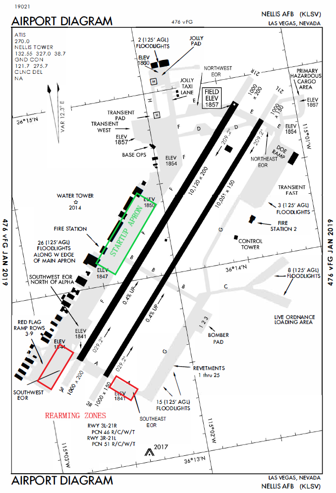
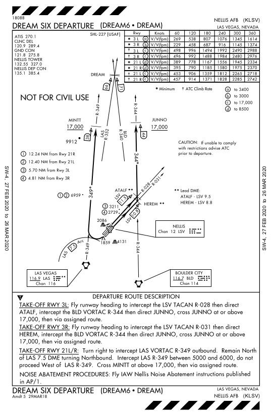
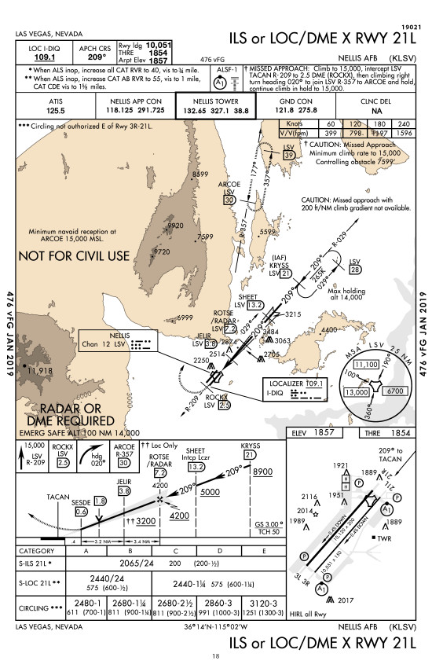

# VIRTUAL RED FLAG: LOCAL PROCEDURES

## VER 1.2 MARCH 2020

## TABLE OF CONTENTS

1.  [START-UP](#1--start-up) 

2.  [TAXI](#2--taxi)

3.  [DEPARTURE](#3--departure)

4.  [ROUTE](#4--route)

5.  [RECOVERY](#5--recovery)

6.  [ANNEX A. AAR](#annex-a-aar)

7.  [ANNEX B. FREQUENCIES](#annex-b-frequencies)

### 1.  **START-UP**

All participants will start up engines stick to each type of aircraft normal procedures. Normally will use this radio setting procedure for ground, taxi, departure/approach and interflight COMMS. All platforms should adhere to the following PRESET plan:

● ATIS: PRESET #1 270.1 UHF, for last weather information updates.

● GND:  PRESET #2 275.8 UHF/121.8 VHF, for ground control if available.

● TWR:  PRESET #3 327.0 UHF/132.55 VHF for ATC control.

● INTERFLIGHT: PRESET VHF #X, according to the assigned frequency in the Commcard.

All formations will request weather info on ATIS 270.100. If ground control is available, all formation will ask for taxi on GND frequency. In other case, TWR frequency will be used for taxi and departure.

### 2.  **TAXI**

Once ready for taxi each formation will ask to GND/TWR controller for taxing to active,  RWY 03R or 03L. Each formation will start taxi not before the preceding one according to the ATO. In the event of a flight unable to accoplish with their taxi time, it will communicate this event in GND/TWR frequency and the following formation in the ATO  will ask for taxing to the active  in order to avoid delays.

When leader starts taxing will communicate in interflight freq: "Spartan 1, taxing RWY 05R, QNH 29,90". All wingmen will acknowledge: "Spartan 2, QNH 29,90".

All formations will hold in the active arming zone, waiting their respective take off times. In the South EOR south of taxiway Alpha, park in the most southern slot available and fill to the north. In the South EOR north of taxiway Alpha, park in the most northern slot available and fill to the south.

### 3.  **DEPARTURE**

Once formations are cleared for departure they will enter and take off following VMC or IMC procedures depending on the Airfield weather conditions:

● VMC: NORTH FLEX / DREAM 3 departure in use. Take Off will be 1+1 at 10" spacing with visual rejoin when airborne. Afterwards will proceed to first route waypoint. This one will be exactly the same for all players in the package.
 
 
 
 
● IMC: DREAM 6 departure in use. Take Off will be 1+1 at 20" spacing. Wingman will maintain 2 NM trail formation till rejoin in VMC above clouds. Afterwards will proceed to first route waypoint. This one will be exactly the same for all players in the package.

After Take Off, ATC controller will clear the formations to change to  Boom Freqency (see AAR appendix) in order to proceed to the refueling area. 

### 4.  **ROUTE**

Once airbone formations will proceed direct to waypoint A1: HAREM, B2: JUNNO. This point will be common WPT for all participants and will be also ARCP for formations refueling from southern tanker (TEXACO KC-135 AAR SOUTH) 19.000 FT. AND northern tanker (ARCO KC-135MPRS NORTH) 18.000 FT. Once with visual contact with tanker, receivers with climb for rejoining and proceed echelon left with tanker

After refueling, formations will proceed to assigned Holding/Push WPT, normally WPT 4 (D4) HOLD and WPT 5 (E5) PUSH, at assigned COMMCARD altitudes. On the way to holding/push formations with contact GCI controller for check-in and tactical flight. MANDATORY CALL FOR ALL FORMATIONS when one minute to reach holding/push point for deconfliction. For instance: "Lobo, 1 minute to D4, maintaining FL230".

### 5.  **RECOVERY**

On the way back and crossing FLOT heading home all formations will contact TWR in 327.000 UHF and will ask for weather, landing data and will request type of approach.

 Landing approach will be done depending on airfield weather conditions:

● VMC: RWY 03 or 21 in use.
 - RWY 21: ARCOE recovery in use.
 
 - RWY 03: STRYK recovery. Aircrews can proceed directly to GASS PK if ATC aproved.
 
 
● IMC: RWY 21 in use.

- During IMC or NIGHT (VMC or IMC), aircrews should expect vectors for ILS or TACAN approach to RWY 21.

- RWY 21 is the preferred landing runway for IMC/Night recoveries. Night recoveries from the nellis Ranges should proceed to the IFR pickup point for the appropiate recovery and contact nellis control. North/Easthern recoveries will be via TEXAS LAKE. South/Western recoveris Will be via FLUSH. Expect ARCOE or KRYSS ILS approach. Flight Leads will be responsible of separation till to be under ATC control. If situation requires they can proceed MARSA (Military Assume Responsability for Separation of Aircraft), with previous formation.

### **ANNEX A. AAR**

 Rejoining and communication procedure with tanker as described:

 - When airborne northern refueling formation will use preset UHF #13, while southern will use preset UHF #12. 
 
 - Each flight leader must pay attention to the comms in order to deconflict with other formations in the vecinities of the tanker.

 - First find and track our assigned tanker via TACAN and/or AA Radar. NEVER ask something to tanker up to this point. Rejoin and maintain  echelon left formation with the tanker and the other previous formations in the queue.

 - Only when we are next in the queue, we will request _APPROACHING FOR REFUELING_ to the tanker. Once refueling is complete, aircraft will proceed to right echelon with tanker and will end DCS procedure making call in DCS tanker menu, _ABORT REFUEL_.

This is an individual procedure that everybody must accomplish. Please maintain concentration up to this point and make correct calls.

### **ANNEX B. FREQUENCIES**

[Back to mainpage](../README.md)

