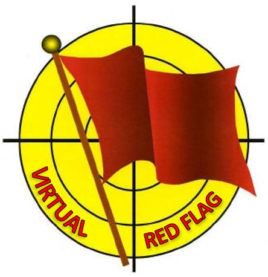
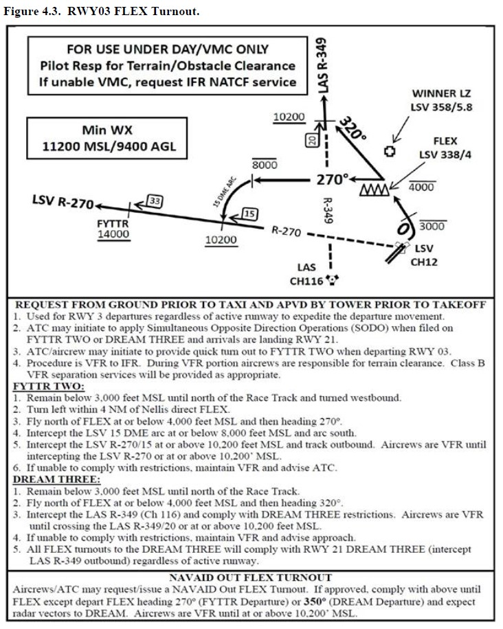
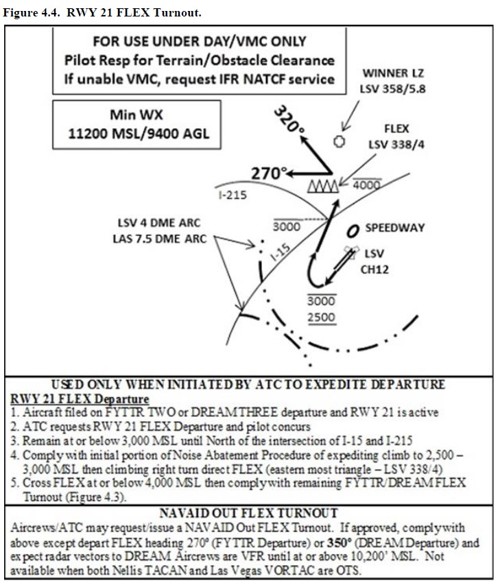
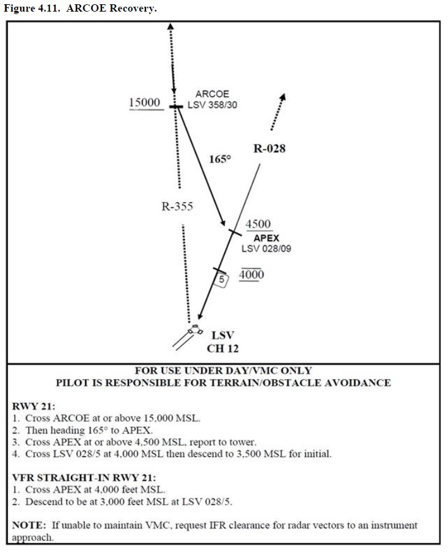
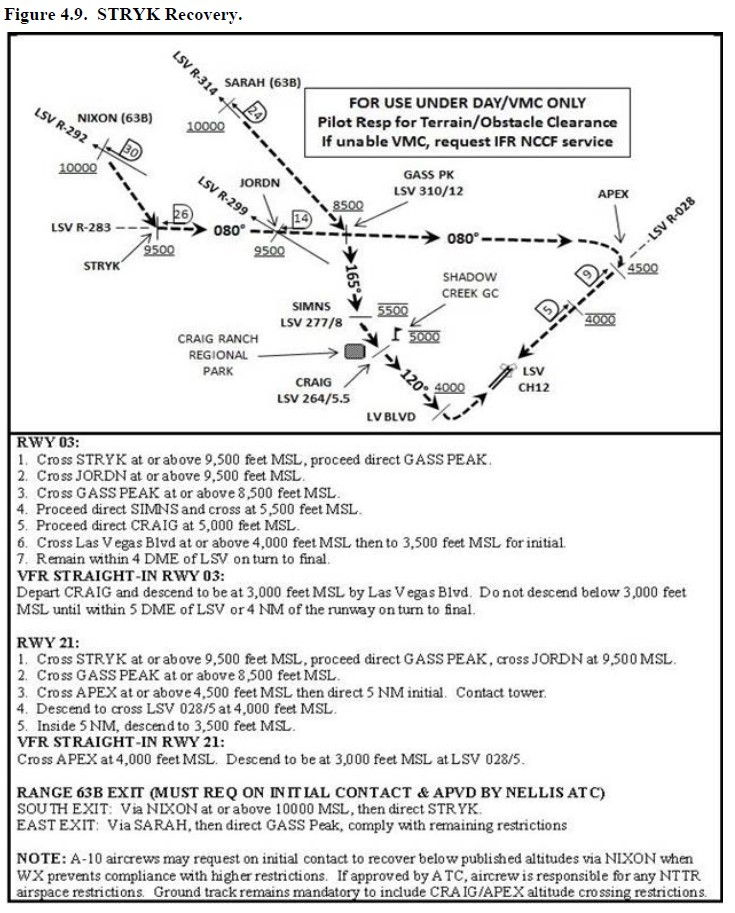

# VIRTUAL RED FLAG: LOCAL PROCEDURES

## VER 1.1 DICIEMBRE 2019

**This issue belongs to (rank/name).............................................**

## TABLE OF CONTENTS

1.  START-UP PROC 

2.  TAXI

3.  DEPARTURE

4.  ROUTE

5.  RECOVERY

6.  ANNEX A. AAR

7.  ANNEX B. FREQUENCIES

### 1.  **START-UP**

All participants will start up engines stick to each type of aircraft normal procedures. Normally will use this radio setting procedure for taxi, departure, GCI and also interflight COMMS:

● TWR: Once in cockpit we set Freq 327.000 UHF/132.550 VHF for ATC control according to CommCard.

● Interflight: VHF #X showing in CommCard and Mission Brief for each formation.

All formations will request weather info and departure data on ATIS: 270.100 and tower freq 327.000 UHF/ 132.550 VHF.

### 2.  **TAXI**

Once formation ready and within taxi times assigned it will be asked to TWR controller for taxing to runway in use. It one formation with problems at start up then following formation will ask for taxing to holding point of runway in use in order to avoid taxi collapsing.

When leader starts taxing will communicate in interflight freq: "Spartan 1, taxing RWY 05R, QNH 29,90". All wingmen will acknowledge: "Spartan 2, QNH 29,90".

All formations will hold the active arming zone waiting their respective take off times.

### 3.  **DEPARTURE**

Once formations cleared for departure will enter and take off depending on Airfield weather conditions.

● VMC: NORTH FLEX departure in use. Take Off will be 1+1 at 10" spacing with visual rejoin when airborne. Afterwards will proceed to first route waypoint. This one will be exactly the same for all players in the package.
 
 
 
 
● IMC: DREAM 6 departure in use. Take Off will be 1+1 at 20" spacing. Wingman will maintain 2 NM trail formation till rejoin in VMC above clouds.

When Take Off procedure complete and airborne, TWR controller will clear the formations to change to Boom Freq. (Take Care, no human controller at this time, will use DCS normal fuel request and refueling procedure).

### 4.  **RUTA**

Once airbone formations will proceed direct to waypoint A1: HAREM, B2: JUNNO. This point will be common WPT for all participants and will be also ARCP for formations refueling from southern tanker (TEXACO KC-135 AAR SOUTH) 19.000 FT. AND northern tanker (ARCO KC-135MPRS NORTH) 18.000 FT. Once with visual contact with tanker, receivers with climb for rejoining and proceed echelon left with tanker

After refueling, formations will proceed to assigned Holding/Push WPT, normally WPT 4 (D4) HOLD and WPT 5 (E5) PUSH, at assigned COMMCARD altitudes. On the way to holding/push formations with contact human GCI for check-in and tactical flight. MANDATORY CALL FOR ALL FORMATIONS when one minute to reach holding/push point for deconfliction. For instance: "Lobo, 1 minute to D4, maintaining FL230".

### 5.  **RECOVERY**

On the way back and crossing FLOT heading home all formations will contact TWR in 327.000 UHF and will ask for weather, landing data and will request type of approach.

 Landing approach will be done depending on airfield weather conditions:

● VMC: RWY 03 or 21 in use.
 - RWY 21: ARCOE recovery in use.
 
 - RWY 03: STRYK recovery in use.
 
 
● IMC: RWY 21 in use.

- During IMC or NIGHT (VMC or IMC), aircrews should expect vectors for ILS or TACAN approach to RWY 21.

- RWY 21 is the preferred landing runway for IMC/Night recoveries. Night recoveries from the nellis Ranges should proceed to the IFR pickup point for the appropiate recovery and contact nellis control. North/Easthern recoveries will be via TEXAS LAKE. South/Western recoveris Will be via FLUSH.
Expect ARCOE or KRYSS ILS approach.

Flight Leads will be responsible of separation till to be under ATC control. If situation requires they can proceed MARSA (Military Assume Responsability for Separation of Aircraft), with previous formation.

### **ANNEX A. AAR**

 Rejoining and communication procedure with tanker as described:

 When airborne northern formation will use preset UHF #13 and southern will use preset UHF #12.  

 First to do is find and track our tanker. We will interdict him. NEVER ask something to tanker up to this point. When rejoining completed echelon left formation must to be maintained with tanker or other previous formations in the queue.

 Only at the right moment we are the closed formation to the tanker, it means we are next for refueling, will request refuel to the tanker. Once refueling complete, refueled aircraft will proceed to right echelon with tanker and will end DCS procedure making call in DCS tanker menu, ABORT REFUEL.

This is an individual procedure that everybody must accomplish. Please maintain concentration up to this point and make correct calls.

### **ANNEX B. FREQUENCIES**

